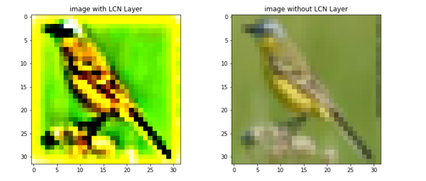

# EfficientNet with addition of LCN Layer
 In this project we implement EfficnetNet with addition of "Local Contrast Normalization" to examine the effect of this layer on EfficnetNet.
 This project is impelemnted in Pytorch.

 
 ## Local Contrast Layer
  The goal of using this layer is add some noise to dataset and make network robust to this noises.
  This Layer can be applied to DataSet becuase it has no parameter to train.
  A sample of training dataset: 
  

 
 ## Dataset
 We use CIFAR10 Dataset for training and inference.
 
 ## Training
 We compare result with two different methods:
 - EfficientNet with addition of LCN layer
 - EfficientNet without addition of LCN layer 
 
Below is the train EfficientNet with and without LCN Layer loss and accuracy plot. 
Training EfficientNet loss plot: 
 
Trainign EfficientNet accuracy plot: 

 

 
 ## resualt
 
 |        | Without LCN layer | With LCN layer  |
 |-----   |-------------------|-----------------|
 |Accuracy|      0.6964       |     0.7110      |
 
