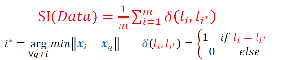

# Auto-encoder Feature Selection with SI

## Seperation Index(SI)

Seperation Index (SI) is a seperating measure in classification problems. It shows that how much input data points seperate the labels from eachother.
We can use SI for feature selection, the feature that creates more SI is more informative. 
Below is the SI Formula:  
 

## Dataset
We use CIFAR10 and CIFAR100 for training and inference.

## Training
We compare result with five different methods:
- Auto-encoder with VGG16 backbone on CIFAR10
- Auto-encoder with Convolutional layers on CIFAR10
- Pretrained VGG16 on CIFAR10
- Variational Auto-Encoder on CIFAR10
- Variational Auto-encoder on CIFAR100

## Resualts

| radif |  model    | Dataset |  latent space features | selected features| SI on latent space features| SI on selected features|SI changes|
| ------|-----------|---------|------------------------|------------------|----------------------------|------------------------|----------|
