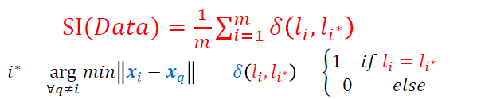
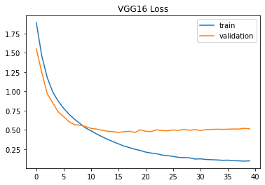
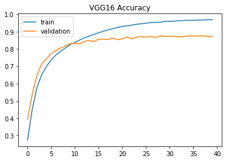
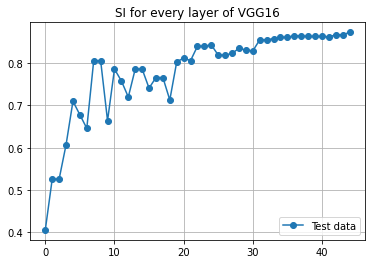

# Layer-wise Analysis Using "SI"

## Seperation Index(SI)

Seperation Index (SI) is a seperating measure in classification problems. It shows that how much input data points seperate the labels from eachother. 
Below is the SI Formula:  

## Dataset
We use CIFAR10 for training and inference

## Training

we train the network for 40 epochs and calculate SI for every layer of VGG16. 
Below is the loss and accuracy plots: 
Loss plot: 
 
Accuracy plot: 

## Resualts:
As can be seen in plot below, the initial layers have less SI, as we get closer to the final layers
SI has increased.

